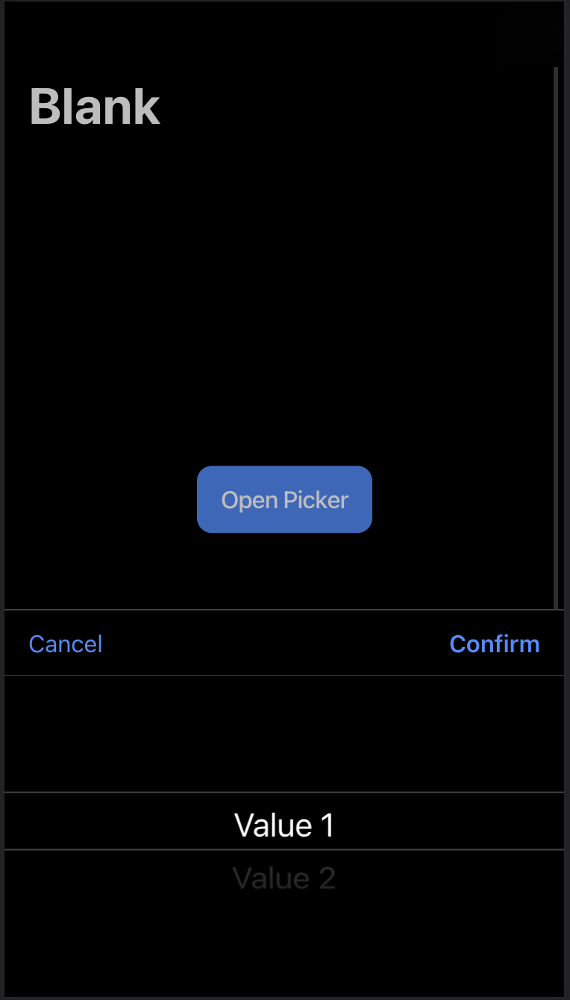

# Simple IonPicker Example
This app was created to demonstrate how to create and present an [IonPicker](https://ionicframework.com/docs/api/picker) using the `useIonPicker` hook in React.

## Developer Setup
Run the following commands to serve the app:
```bash
npm install
ionic serve
```

## Usage
Once the app is served, click the "Open Picker" button to see the picker open.
Select a value, and click "Confirm" to see the `console.log` output with the result.

<div>
  
</div>